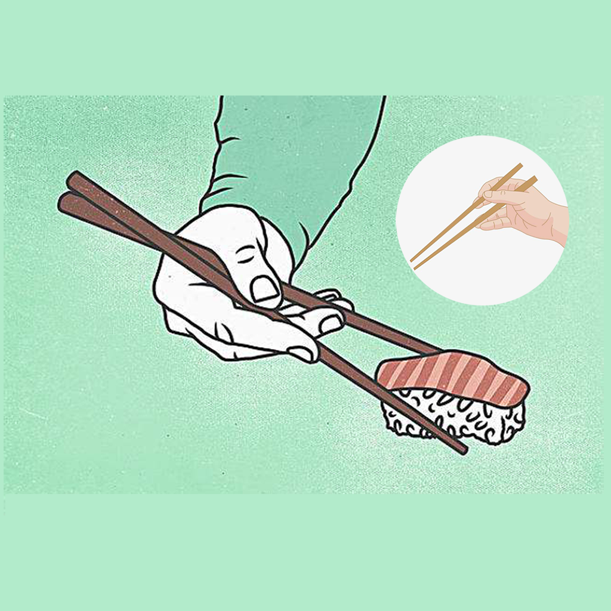

## Welcome to Child Chopsticks Record Tool

Have you ever had a situation where your child didn't know how to use chopsticks, or didn't use them the right way, leading to food failure or slow or difficult eating? This app can help you solve this problem well. When you eat with your child, you can teach him how to use chopsticks, and you can record the process, as well as the color of his favorite chopsticks, eating habits and whether he is happy. You can write them down and store them. Convenient for you to manage the correct use of the child, let the child healthy growth.

If you have any questions, you can either leave a message or send the questions to our email address.

We will answer them for you in the first time.

### Address: sun778297ma@163.com

Thank you!
